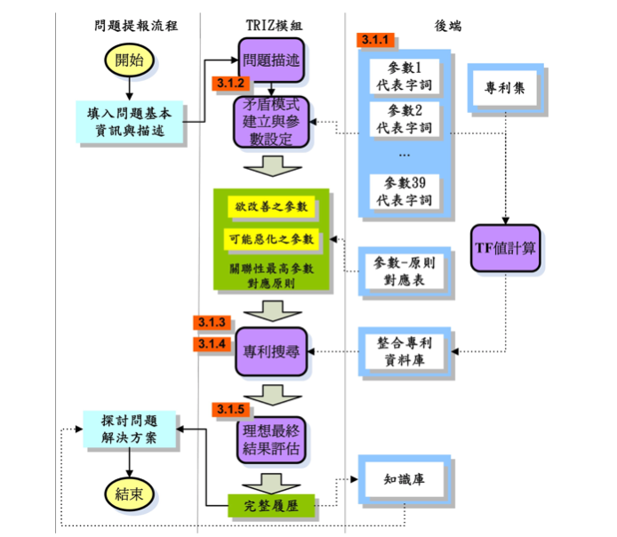

# NTUT_TRIZ_PDM

Basic feature list:

 * ASP.NET
 * WebForm
 * C#
 * MSSQL

萃智(TRIZ)是一種代表創新是規律性的系統化問題思考方法，針對不同矛盾種類並依照問題類型提供工程與管理方案；產品資料管理(PDM)系統為一套專門為研發資料管理設計的資訊系統，對於產品生命週期中相關之文件、表單與圖檔等做有效率的保存與分享，提高生產力。本研究論文提出以TRIZ創新與PDM系統之整合應用，透過所設計之系統化TRIZ問題解決流程整合PDM系統相關模組，以全電子化方式即時於PDM系統模組中發起問題專案進入TRIZ模組，經過問題描述、矛盾模式建立、輔助參數選取、原則對應、高關聯專利檢索、解決方案理想性評估、輸出履歷等步驟，完整履歷文件將回饋於PDM系統當中，充分結合兩者優點，達到知識累積與再利用之效益，最後以工具機問題改善做驗證。

